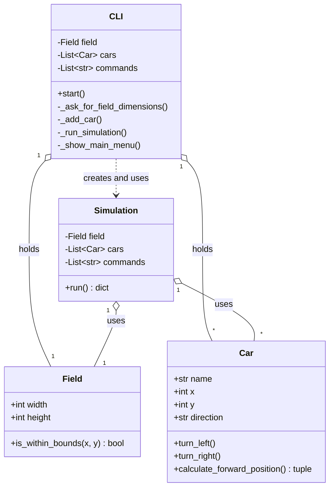

```mermaid
classDiagram
    class CLI {
        -Field field
        -List~Car~ cars
        -List~str~ commands
        +start()
        -_ask_for_field_dimensions()
        -_add_car()
        -_run_simulation()
        -_show_main_menu()
    }

    class Simulation {
        -Field field
        -List~Car~ cars
        -List~str~ commands
        +run() dict
    }

    class Field {
        +int width
        +int height
        +is_within_bounds(x, y) bool
    }

    class Car {
        +str name
        +int x
        +int y
        +str direction
        +turn_left()
        +turn_right()
        +calculate_forward_position() tuple
    }

    CLI "1" o-- "1" Field : holds
    CLI "1" o-- "*" Car : holds
    CLI ..> Simulation : creates and uses

    Simulation "1" o-- "1" Field : uses
    Simulation "1" o-- "*" Car : uses
```
