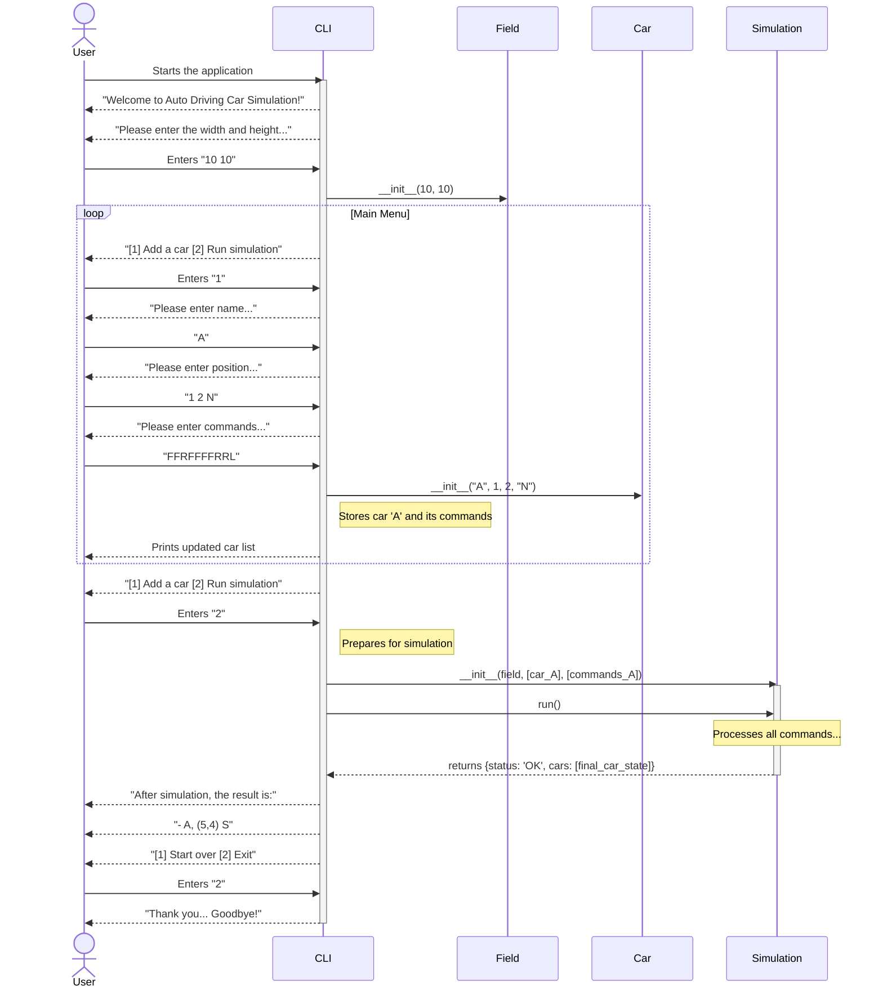

```mermaid
sequenceDiagram
    actor User
    participant CLI
    participant Field
    participant Car
    participant Simulation

    User->>CLI: Starts the application
    activate CLI

    CLI-->>User: "Welcome to Auto Driving Car Simulation!"
    CLI-->>User: "Please enter the width and height..."
    User->>CLI: Enters "10 10"
    CLI->>Field: __init__(10, 10)

    loop Main Menu
        CLI-->>User: "[1] Add a car [2] Run simulation"
        User->>CLI: Enters "1"
        
        CLI-->>User: "Please enter name..."
        User->>CLI: "A"
        CLI-->>User: "Please enter position..."
        User->>CLI: "1 2 N"
        CLI-->>User: "Please enter commands..."
        User->>CLI: "FFRFFFFRRL"

        CLI->>Car: __init__("A", 1, 2, "N")
        note right of CLI: Stores car 'A' and its commands

        CLI-->>User: Prints updated car list
    end

    CLI-->>User: "[1] Add a car [2] Run simulation"
    User->>CLI: Enters "2"

    note right of CLI: Prepares for simulation
    CLI->>Simulation: __init__(field, [car_A], [commands_A])
    activate Simulation

    CLI->>Simulation: run()
    note over Simulation: Processes all commands...
    Simulation-->>CLI: returns {status: 'OK', cars: [final_car_state]}
    deactivate Simulation

    CLI-->>User: "After simulation, the result is:"
    CLI-->>User: "- A, (5,4) S"

    CLI-->>User: "[1] Start over [2] Exit"
    User->>CLI: Enters "2"
    CLI-->>User: "Thank you... Goodbye!"
    deactivate CLI
```