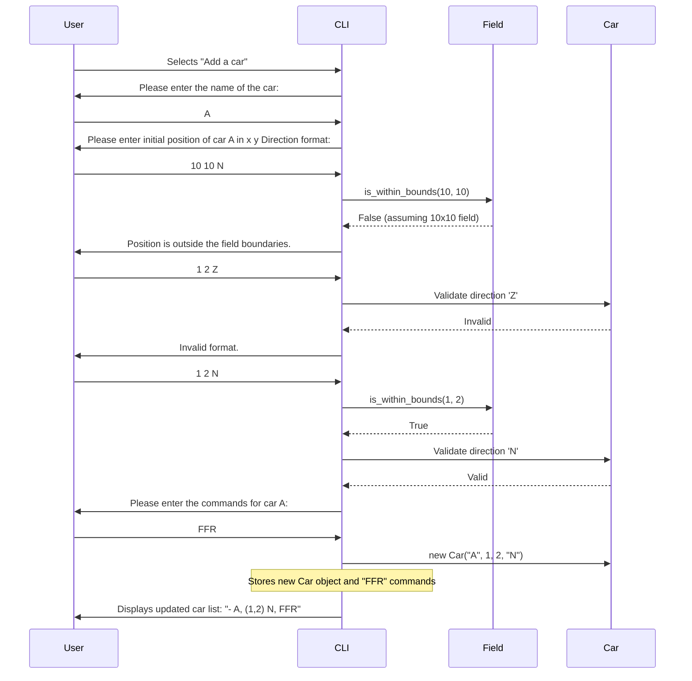

```mermaid
sequenceDiagram
    participant User
    participant CLI
    participant Field
    participant Car

    User->>CLI: Selects "Add a car"
    CLI->>User: Please enter the name of the car:
    User->>CLI: A
    CLI->>User: Please enter initial position of car A in x y Direction format:
    User->>CLI: 10 10 N
    
    CLI->>Field: is_within_bounds(10, 10)
    Field-->>CLI: False (assuming 10x10 field)
    CLI->>User: Position is outside the field boundaries.
    User->>CLI: 1 2 Z
    
    CLI->>Car: Validate direction 'Z'
    Car-->>CLI: Invalid
    CLI->>User: Invalid format.
    User->>CLI: 1 2 N
    
    CLI->>Field: is_within_bounds(1, 2)
    Field-->>CLI: True
    CLI->>Car: Validate direction 'N'
    Car-->>CLI: Valid
    
    CLI->>User: Please enter the commands for car A:
    User->>CLI: FFR
    
    CLI->>Car: new Car("A", 1, 2, "N")
    Note over CLI: Stores new Car object and "FFR" commands
    
    CLI->>User: Displays updated car list: "- A, (1,2) N, FFR"
```