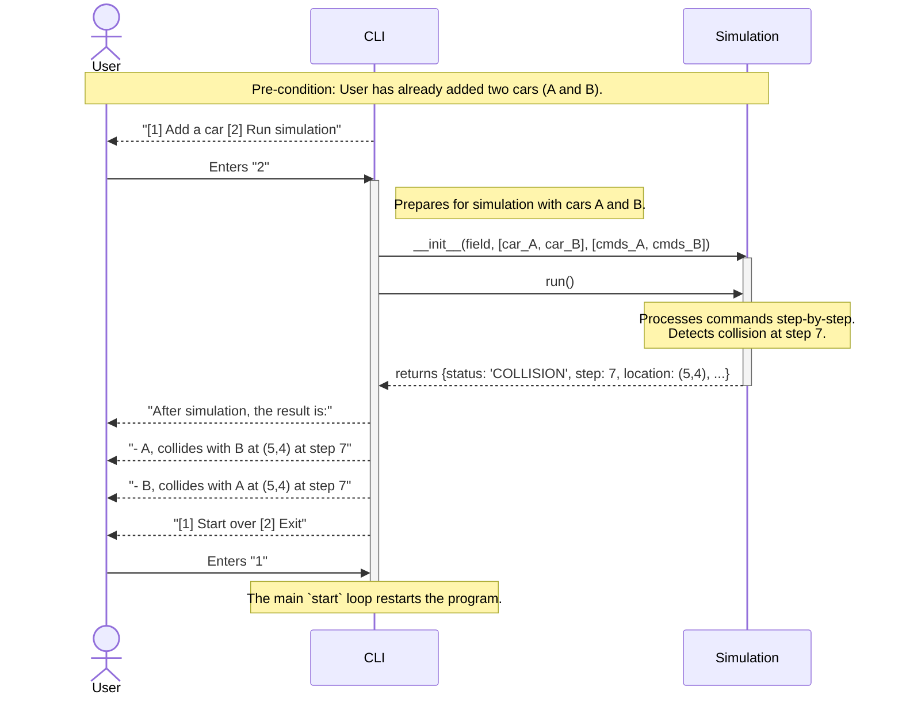

```mermaid
sequenceDiagram
    actor User
    participant CLI
    participant Simulation

    Note over User, Simulation: Pre-condition: User has already added two cars (A and B).

    CLI-->>User: "[1] Add a car [2] Run simulation"
    User->>CLI: Enters "2"
    activate CLI

    note right of CLI: Prepares for simulation with cars A and B.
    CLI->>Simulation: __init__(field, [car_A, car_B], [cmds_A, cmds_B])
    activate Simulation

    CLI->>Simulation: run()
    note over Simulation: Processes commands step-by-step.<br/>Detects collision at step 7.
    Simulation-->>CLI: returns {status: 'COLLISION', step: 7, location: (5,4), ...}
    deactivate Simulation

    CLI-->>User: "After simulation, the result is:"
    CLI-->>User: "- A, collides with B at (5,4) at step 7"
    CLI-->>User: "- B, collides with A at (5,4) at step 7"

    CLI-->>User: "[1] Start over [2] Exit"
    User->>CLI: Enters "1"
    note over CLI: The main `start` loop restarts the program.
    
    deactivate CLI
```
