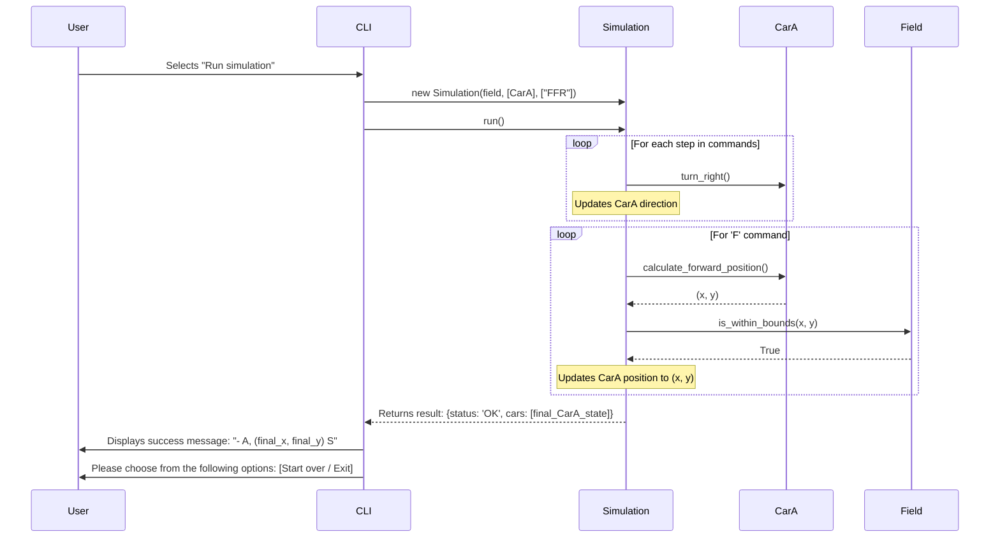

```mermaid
sequenceDiagram
    participant User
    participant CLI
    participant Simulation
    participant CarA
    participant Field

    User->>CLI: Selects "Run simulation"
    CLI->>Simulation: new Simulation(field, [CarA], ["FFR"])
    CLI->>Simulation: run()

    loop For each step in commands
        Simulation->>CarA: turn_right()
        Note over Simulation: Updates CarA direction
    end

    loop For 'F' command
        Simulation->>CarA: calculate_forward_position()
        CarA-->>Simulation: (x, y)
        Simulation->>Field: is_within_bounds(x, y)
        Field-->>Simulation: True
        Note over Simulation: Updates CarA position to (x, y)
    end
    
    Simulation-->>CLI: Returns result: {status: 'OK', cars: [final_CarA_state]}
    CLI->>User: Displays success message: "- A, (final_x, final_y) S"
    
    CLI->>User: Please choose from the following options: [Start over / Exit]
```