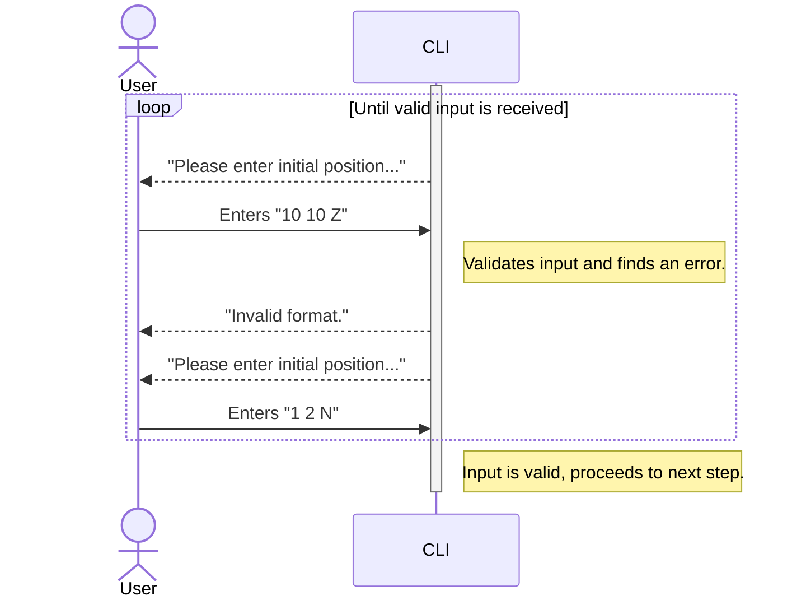

```mermaid
sequenceDiagram
    actor User
    participant CLI

    activate CLI
    loop Until valid input is received
        CLI-->>User: "Please enter initial position..."
        User->>CLI: Enters "10 10 Z"

        note right of CLI: Validates input and finds an error.
        CLI-->>User: "Invalid format."

        CLI-->>User: "Please enter initial position..."
        User->>CLI: Enters "1 2 N"
    end
    note right of CLI: Input is valid, proceeds to next step.
    deactivate CLI
```